- [User Management Dashboard](#user-authorization-project)

  - [Running Application](#running-app)
  - [Rules](#rules)
  - [Roles](#roles)
  - [About Application](#about-app)
  - [TO DO](#to-do)
  - [Screenshots](#screenshots)
    - [Login - Register And Angular Form Validation](#login---register-and-angular-form-validation)
    - [Customer](#customer)
    - [Admin](#admin)
    - [Super Admin](#super-admin)

# User Management Dashboard

Welcome to User Management Dashboard! 

* This application has 3 types of roles : (Super Admin, Admin, Customer) 

* This application has 6 pages : (Login, Register, Home, User Listing, 401 and 404)

> Some available accounts:
>
> - superadmin@mail.com
> - admin@mail.com
> - customer@mail.com
>
>   All passwords are same: `12345@Aa`
>
>   You could take a look to db.json for more account data.

## Running Application

git clone https://github.com/PranamBhat/User-Management-Dashboard.git

cd User-Management-Dashboard

npm install

npm start

## Rules

- All users can view Homepage when they logged in. Homepage protected by `LoginGuard (Router-Guard)` that allow to only authorized users. If user have not token will be redirect to Login page.
- Navigation provided by Navbar buttons by using `RouterLink`. User List button will be hidden if you are not Super Admin.
- User List page protected by `AdminGuard (Router-Guard)` that allow to access only users has role Super Admin. If Customer try to go User List page will be redirect to 401 - Forbidden page.
- Edit user, add user, delete user functions available in User List page.
- Username cannot be change because of used to login. Also changing the password is not allowed.
- Admin can't change user roles and can't list other admins. When admin create a user, user's role will be Customer by the default. Also Admin can delete only customers.
- Super Admin can update role and can list all users.
- Super Admin can't delete itself, but can delete other Super Admin's accounts.
- Everyone can login or register to application. But if logged user try to reach Login or Register page will be redirect to Home page. Login and Register pages protected by `NotLoginGuard (Router-Guard)`.
- This app uses `JSON Server` for creating fake database and `JSON Server Auth` to manage login - register operations. By the way auth token has 1 hour life time.

## Roles

- Super Admin _(role value: 3)_
- Admin _(role value: 2)_
- Customer _(role value: 1)_

## About Application

- Created with Angular v13
- Uses Angular Material Framework for app compoments
- CSS template engine is SCSS
- Bootstrap Reboot, Bootstrap Grid, Bootstrap Tables and Bootsrap Aler imported with Sass
- Ngx Cookie Service used to handle cookies
- User ids gererated with uuid
- concurrently used to run multiple script commands in same time

## TO DO

- NGRX should be use to state managament
- Usualy i use `toPromise()` for converting observables to promise then use in async functions with await. I think it make codes more readable and avoid problems like cold observale and unsubscribe. Now `toPromise()` is depraced, need to find new method instead of it.

## Screenshots

### Login - Register And Angular Form Validation

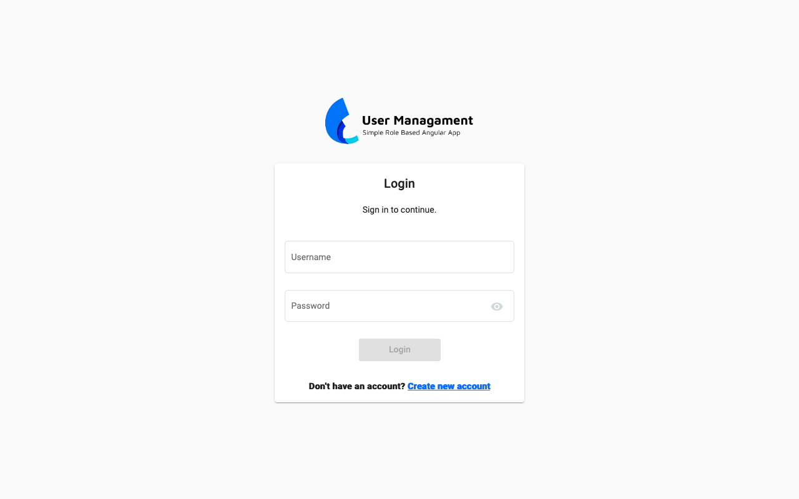

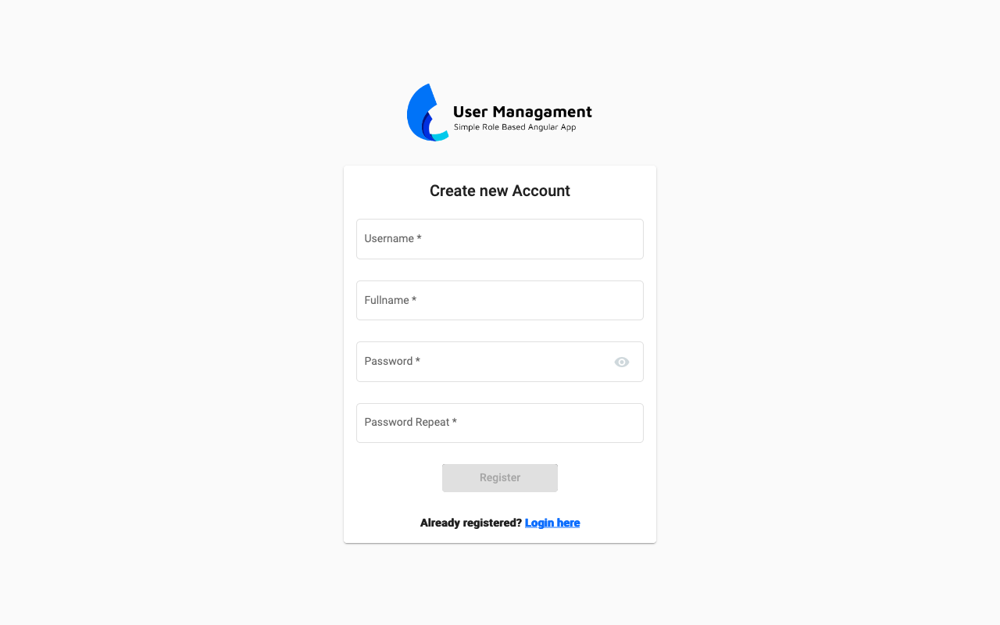

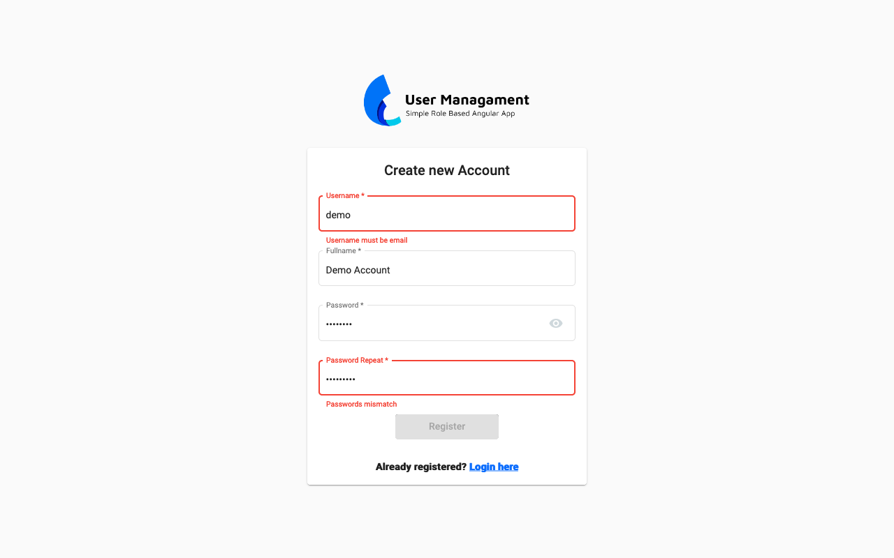

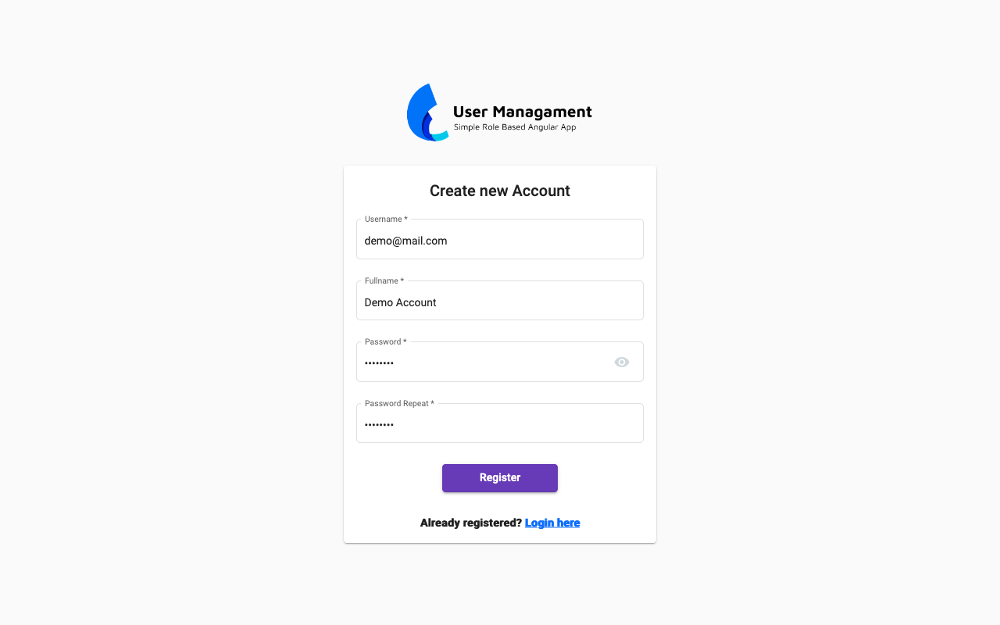

### Customer

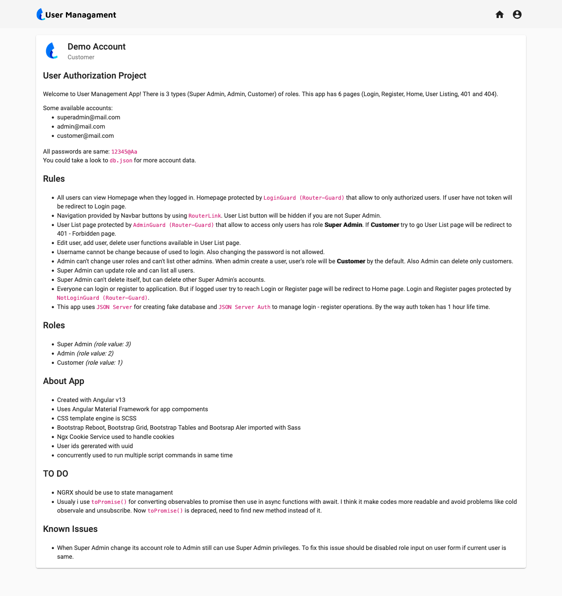

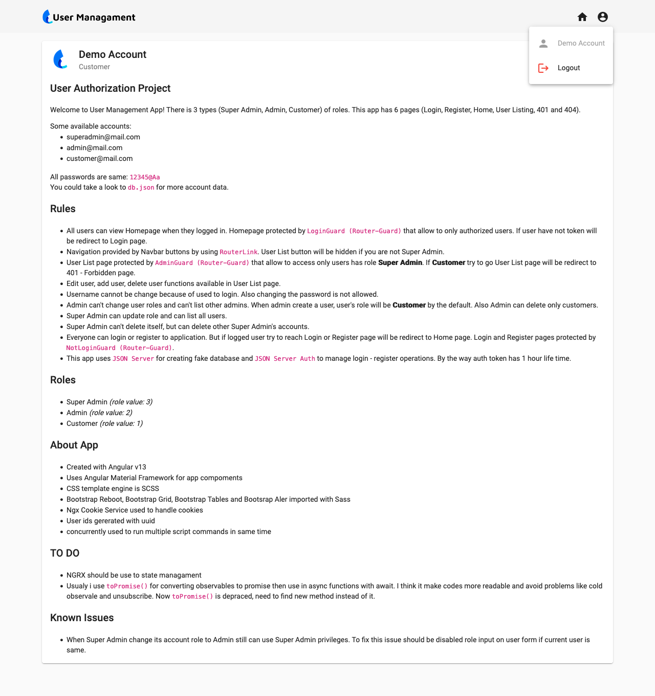

### Admin

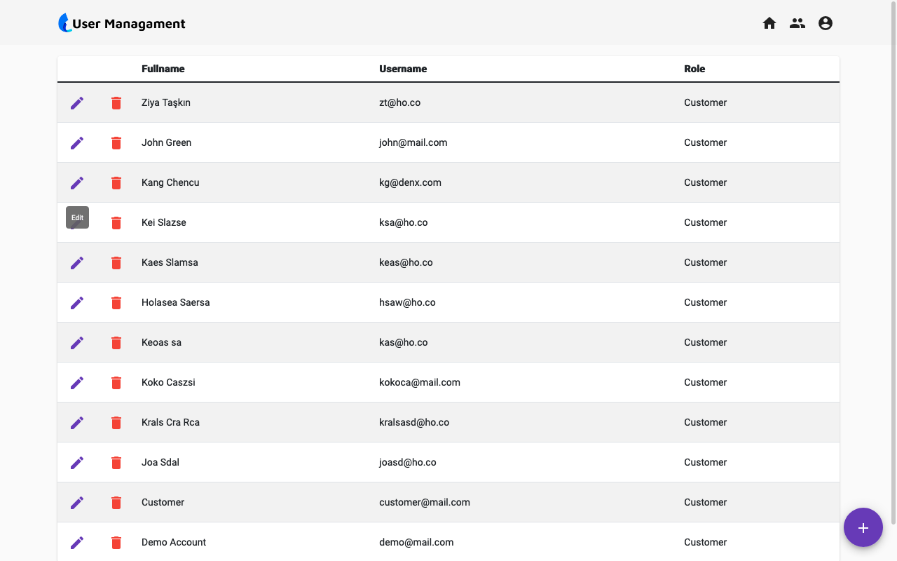

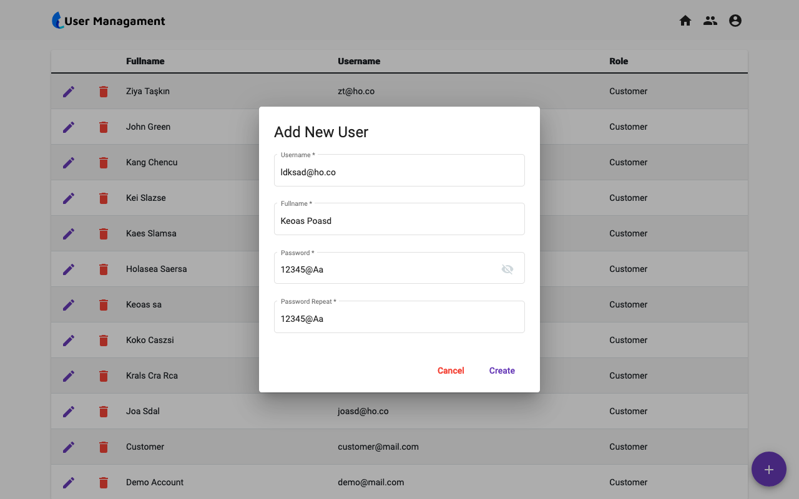

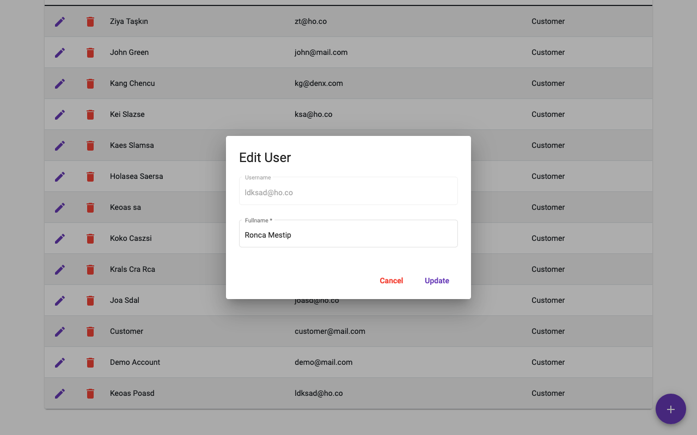

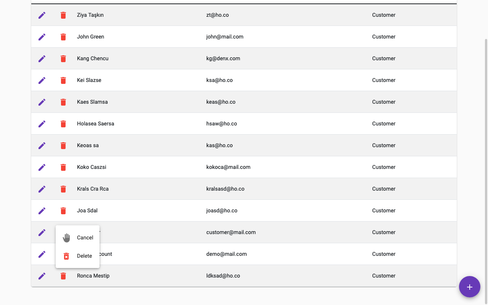

### Super Admin

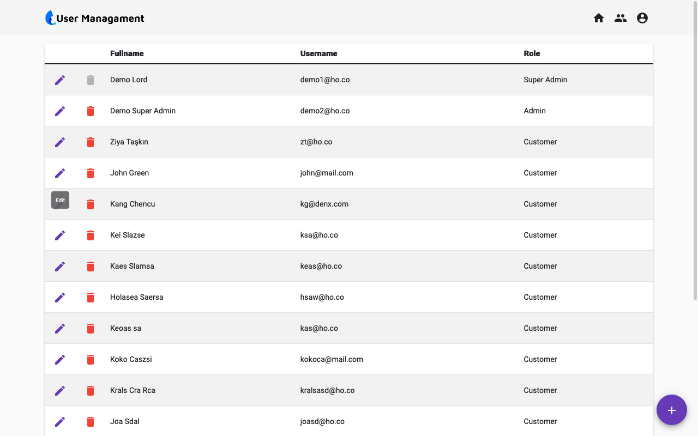

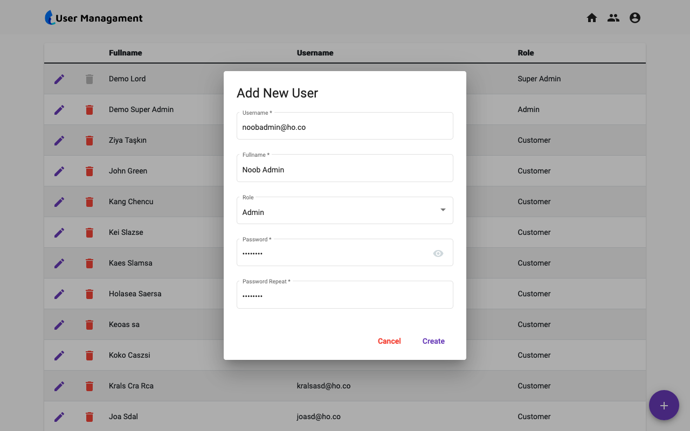

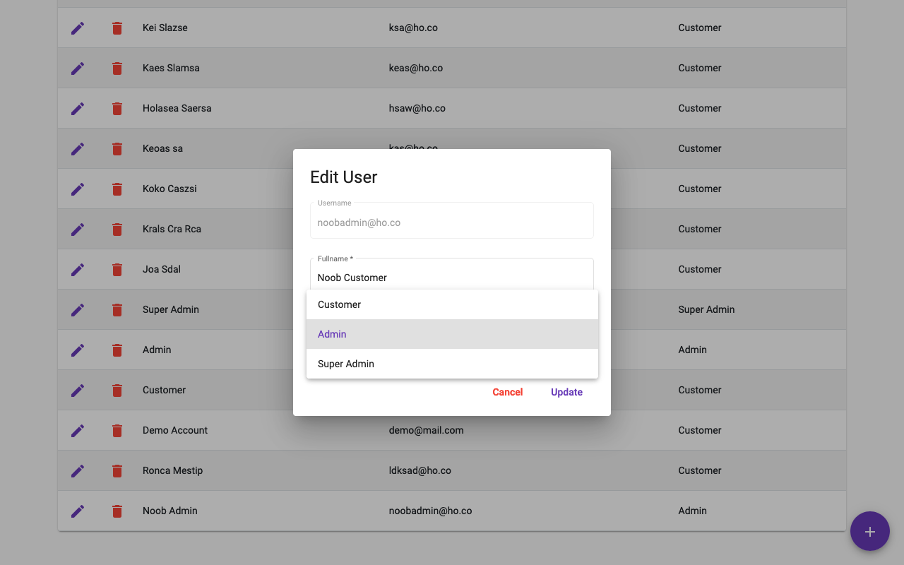

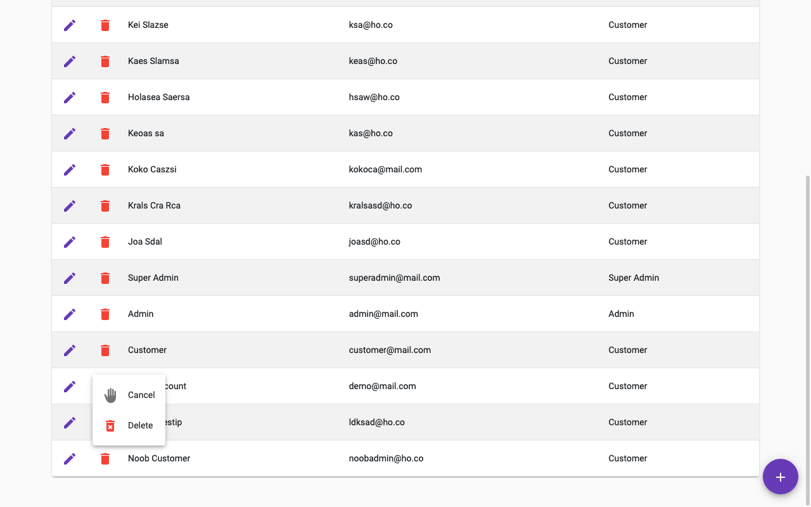

## From Developer

You can get in touch with me on my LinkedIn Profile: 

You can also follow me on GitHub to stay updated about my latest projects: 

If you liked the repo then kindly support it by giving it a star ⭐

### Contact

Made with :heart: by Pranam Bhat. Connect me on https://www.linkedin.com/in/pranam-bhat-11670689/

For any queries : pranam707@gmail.com

